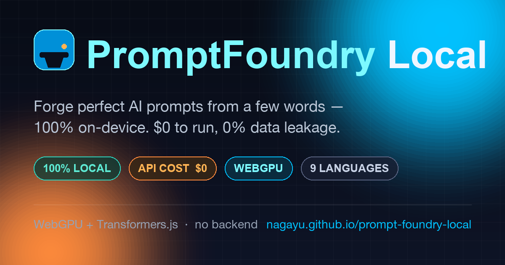

# ⚒️ PromptFoundry Local

[](https://nagayu.github.io/prompt-foundry-local/)
&nbsp;
&nbsp;
&nbsp;

[](https://nagayu.github.io/prompt-foundry-local/)

**Forge perfect AI prompts from a handful of words — 100% in your browser. Zero servers. Zero API cost. Zero data leakage.**

> **▶ Try it live:** **https://nagayu.github.io/prompt-foundry-local/** — opens in your browser, caches the model once, then runs offline.

PromptFoundry Local reads your loose keywords or bullet points, *predicts the product or intent you actually want*, and casts three production-grade prompts:

- 🎨 **Image Generation Prompt** — Midjourney / Stable Diffusion style, with camera, lens, lighting, palette + a matching **negative prompt** (always English for max compatibility).
- 💬 **Text / Task Prompt** — a structured, reusable ChatGPT / Claude prompt (Role · Context · Task · Output Format · Constraints) in **any language you pick**.
- ⚙️ **System Setup Prompt** — a system prompt embodying three philosophies: *Local-first · Data sovereignty · Zero waste*.

The intent prediction runs on a small open-source LLM **inside your browser** via **WebGPU** (Transformers.js), with an automatic **WASM fallback** for older machines. After the one-time model download, it works **fully offline**.

🌍 **Full multilingual UI** — Japanese, English, 中文, 한국어, Español, Français, Deutsch, العربية (RTL), हिन्दी.

---

## 🚀 3-Minute Quick Start (just open a file)

You do **not** need Node, Python, a build step, or any server.

1. Download / clone this folder (`prompt-foundry-local/`).
2. **Double-click `index.html`** to open it in a modern browser.
   - Recommended: **Chrome / Edge 121+** or **Safari 18+** (for WebGPU acceleration).
3. On first use, the app downloads a small model into your browser cache (progress bar shown). This happens **once**; afterwards it runs offline.
4. Type a few words or bullet points on the left → pick a mode & output language → press **⚒️ Forge Prompts**.
5. Click **Copy** on any card. Done.

> 💡 **Tip — even faster + bullet-proof offline:** serve the folder locally so the browser can fully cache everything:
> ```bash
> cd prompt-foundry-local
> python3 -m http.server 8000
> # open http://localhost:8000
> ```
> Opening via `file://` also works, but a local server gives the most reliable caching and clipboard behaviour.

### Models you can choose
| Model | Size (cached once) | Best for |
|---|---|---|
| **Qwen2.5 0.5B** (default) | ~0.4 GB | ⚡ Fastest, fully multilingual |
| **Qwen2.5 1.5B** | ~1.1 GB | ⚖️ Higher quality, multilingual |
| **Phi-3.5 mini** | ~2.1 GB | 🧠 Highest quality |

### Install it as an app (PWA)
Served over http(s), PromptFoundry Local is an installable Progressive Web App: look for the **Install** icon in your browser’s address bar (or *Share → Add to Home Screen* on mobile). Once installed, a **service worker** caches the app shell + library, so the app **opens and runs offline** (the model is cached separately by Transformers.js on first use).

### 🔌 Fully offline — even the first run (optional)
By default the model streams once from a CDN, then the browser caches it for offline use. If you want **zero network on the very first launch** too, bundle the model locally:

```bash
cd prompt-foundry-local
./download-model.sh                       # default: Qwen2.5-0.5B  (~0.4 GB)
# ./download-model.sh onnx-community/Qwen2.5-1.5B-Instruct   # or another model
```
Then set `const USE_LOCAL_MODEL = true;` near the top of `app.js` and serve the folder. Now nothing — not the library cache, not the weights — touches the network.

### Keyboard
- **⌘/Ctrl + Enter** in the input box → Forge.

### Troubleshooting
- *“It fell back to WASM / it’s slow.”* Your browser/GPU doesn’t expose WebGPU. It still works — just slower. Use Chrome/Edge 121+ for the GPU path.
- *First load takes a while.* That’s the one-time model download; the UI stays responsive because all loading runs in a Web Worker. Subsequent runs are instant and offline.
- *Clipboard didn’t copy on `file://`.* Some browsers restrict the clipboard on the `file://` protocol — use the local-server method above.

---

## 🌐 Deploy your own live demo (GitHub Pages, free)

This is a fully static site, so hosting is free and trivial. With this folder as the repo root:

1. Create a new GitHub repository and push:
   ```bash
   git remote add origin https://github.com/<you>/prompt-foundry-local.git
   git push -u origin main
   ```
2. In the repo: **Settings → Pages → Build and deployment → Source: “Deploy from a branch” → Branch: `main` / `/ (root)` → Save.**
3. Your live demo appears at `https://<you>.github.io/prompt-foundry-local/` within a minute.

Notes: GitHub Pages serves over HTTPS, so the **PWA installs and works offline**. WebGPU and single-threaded WASM both work there (no special headers needed). The `.nojekyll` file is included so all assets are served as-is. Netlify, Cloudflare Pages, and Vercel work the same way (point them at this folder).

---

## 🏗️ Architecture (why it costs $0 to run, forever)

```
┌──────────────────────────── Browser (the only runtime) ────────────────────────────┐
│                                                                                     │
│   index.html  ── UI shell (Tailwind CDN) · 9-language i18n · dark "foundry" theme    │
│        │                                                                            │
│   app.js      ── orchestration · prompt forging · i18n · savings ledger             │
│        │  postMessage                                                               │
│        ▼                                                                            │
│   Web Worker  ── Transformers.js → WebGPU (q4f16)  ──fallback──►  WASM (q4)          │
│        │            • model + weights cached in the browser (one-time download)      │
│        ▼                                                                            │
│   Local Intent Engine  ── predicts intent → forges image / text / system prompts     │
│                                                                                     │
└─────────────────────────────────────────────────────────────────────────────────────┘
        ⛔ No backend.  ⛔ No external AI API.  ⛔ No telemetry.  ⛔ No per-request cost.
```

- **Single-page core:** `index.html` + `app.js` (with `README.md`). Optional production extras: `manifest.webmanifest` + `sw.js` + `icon.svg` (installable, offline PWA) and `download-model.sh` (fully-offline first run).
- **Off-main-thread inference:** model loading and token generation happen in a Web Worker (built from a Blob, so the project stays three clean files), so the UI never freezes during the first multi-hundred-MB download.
- **WebGPU with graceful WASM fallback:** detected at runtime; if a WebGPU op is unsupported, it transparently retries on WASM.
- **Robust forging:** the model predicts intent; deterministic enhancers guarantee quality boosters, negative prompts, and a well-structured system prompt even when a tiny model is imperfect.
- **The only network traffic** is the one-time CDN fetch of the library + model weights. There is **no inference server** — so there is **no marginal cost per prompt, ever.**

---

## 💼 For Acquirers (Acquire.com / strategic buyers)

### The 2026 problem: the **Prompt Divide**
Generative AI capability is now gated less by model access and more by *prompting skill*. Most people cannot translate a vague idea into a high-yield prompt — and the “prompt helper” tools that exist today all route user input through **paid, server-side LLM APIs**. That means three structural liabilities every incumbent is quietly paying for:

1. **Marginal cost that scales with usage** — every prompt is an API call you pay for.
2. **Data-exfiltration & compliance risk** — user IP and PII traverse third-party servers.
3. **Latency & availability** dependence on someone else’s uptime and rate limits.

### What PromptFoundry Local is
A **zero-marginal-cost, zero-data-egress prompt infrastructure** that closes the Prompt Divide by running the intelligence **on the edge — the user’s own device.**

| Dimension | Server-side prompt tools | **PromptFoundry Local** |
|---|---|---|
| Cost per prompt | $$ (API metered) | **$0 (no inference server)** |
| Data leakage | User input leaves device | **0% — never leaves the browser** |
| Gross margin at scale | Compresses as usage grows | **Approaches 100%** |
| Offline | ❌ | **✅ after one-time cache** |
| Compliance (GDPR/HIPAA-friendly) | Hard | **Trivial — no data processed off-device** |
| Languages | Varies | **9 out of the box, fully localized (incl. RTL)** |

### Why this is the **highest-margin AI infrastructure on Earth**
Because the unit economics invert the entire industry: **as adoption grows, your serving cost stays flat at zero.** There is no GPU fleet to scale, no token bill, no rate-limit negotiation. Revenue (licensing, white-label, embedding into existing products) drops almost entirely to the bottom line.

### Strategic fit (GAFAM & beyond)
- **Browser / OS vendors** — a flagship demonstration of on-device AI; bundle as a native “prompt assistant” with no cloud cost.
- **Creative & productivity suites** — embed prompt forging directly in-app with **zero added COGS** and a clean privacy story.
- **Regulated enterprises (finance, health, gov)** — on-device by construction; the simplest possible compliance posture.
- **Hardware makers** — a showcase app that makes new NPUs/GPUs tangibly useful to end users.

### Defensible & extensible
- Pure client-side architecture → trivially embeddable (iframe, web component, WebView, Electron).
- Model-agnostic loader → swap in any future ONNX/Transformers.js model as on-device models improve.
- The localized, RTL-aware i18n layer is a real moat for global distribution.

> **In one line:** PromptFoundry Local turns prompting from a recurring cloud expense into a one-time download — the rare AI product whose margin *improves* with scale.

---

## 🔒 Privacy

Your input is processed entirely in your browser. It is **never** transmitted to any server. No analytics, no tracking, no accounts. The savings counter is stored only in your browser’s `localStorage`.

## 📄 License

MIT — do anything, no warranty.

---

*Built with Transformers.js · WebGPU · Tailwind CSS. No backend was harmed (or paid for) in the making of this app.*
